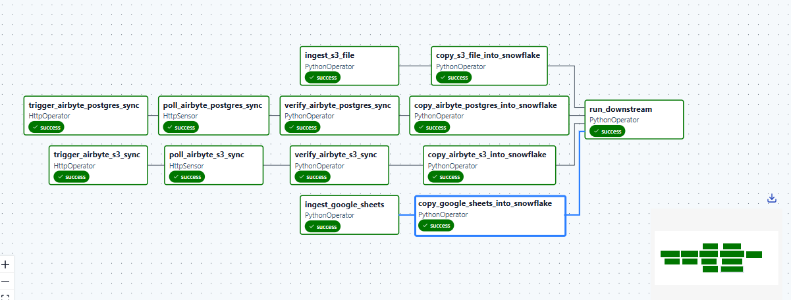

# SupplyChain_DataPlatform
SupplyChain360 is a fast-growing retail distribution company in the United States, managing product distribution across hundreds of retail stores nationwide.

Despite its growth, the company has been struggling with serious operational inefficiencies across its supply chain — popular products run out of stock, slow-moving items clog warehouse space, deliveries are increasingly delayed, and leadership lacks the visibility to answer even basic questions: Which products cause the most stockouts? Which warehouses are underperforming? Which suppliers consistently deliver late?

This Project approaches this issues to solve one probelm: Get the insights SupplyChain360 needs to take back control of its supply chain.

## Project Overview
This project is a fully automated data pipeline with Apache Airflow. It pulls data from three different sources, lands everything in Amazon S3 as Parquet files, loads each source into Snowflake using `COPY INTO`, and only proceeds to downstream transformation after every single source has successfully landed and loaded. It uses Terraform to infrastructure-as-code the entire stack, from raw data ingestion, to storage in a data lake, to transformation and querying in a Data Warehouse. All credentials are managed securely through AWS SSM Parameter Store and nothing is hardcoded. The pipeline is designed around one core principle — **every concern lives in exactly one place**. 

Our Focus here is the data, the tools are the reliable propellers to achieving our desired results.

## Core Objectives
The project was built to satisfy four core analytical requirements:
1. Product Stockout Trends
2. Supplier Delivery Performance
3. Warehouse Efficiency
4. Regional Sales Demand

## The Problem This Solves
Raw data lives in multiple disconnected systems. Business decisions cannot be made from raw, untransformed data scattered across different sources. This pipeline solves that by:
- Centralising data from all sources into one place
- Automating the entire data flow daily without human intervention
- Ensuring data quality through automated testing
- Making the pipeline reproducible by anyone who clones the repository
- Making the infrastructure deployable with a single command

## Architecture Overview
```
Three Data Sources
        ↓
Airbyte Cloud (Ingestion) and Python 
        ↓
Amazon S3 (Data Lake)
        ↓
Snowflake RAW Schema (Loading)
        ↓
dbt Core (Transformation)
        ↓
Snowflake TRANSFORMED Schema (Warehouse)
        ↓
Airflow on VPS (Orchestration)
        ↓
Terraform (Infrastructure as Code)
        ↓
Docker (Containerisation)
        ↓
GitHub (Version Control and CI/CD)
```

### Here is a way to look at the architecture diagrammatically;


## Technology Stack

| Component | Tool | Version |
|---|---|---|
| Data Warehouse | Snowflake | — |
| Ingestion | Airbyte Cloud | — |
| Transformation | dbt Core | 1.8.8 |
| dbt Adapter | dbt-snowflake | 1.8.4 |
| Orchestration | Apache Airflow | 3.1.5 |
| dbt in Airflow | Astronomer Cosmos | 1.13.1 |
| Containerisation | Docker / Docker Compose | — |
| Notifications | Slack | — |

## Project Structure
```
supplychain360/
├── infrastructure/                      # Terraform IaC
│   ├── bootstrap/                       # Remote state bootstrap
│   │   ├── main.tf
│   │   └── versions.tf
│   ├── modules/                         # Reusable Terraform modules
│   │   ├── airbyte/
│   │   │   ├── main.tf
│   │   │   ├── outputs.tf
│   │   │   └── variables.tf
│   │   ├── s3/
│   │   │   ├── main.tf
│   │   │   ├── outputs.tf
│   │   │   └── variables.tf
│   │   └── snowflake/
│   │       ├── main.tf
│   │       ├── outputs.tf
│   │       └── variables.tf
│   ├── backend.tf
│   ├── main.tf
│   ├── outputs.tf
│   ├── provider.tf
│   ├── variables.tf
│   └── terraform.tfvars
└── orchestration/                       # Airflow orchestration
    ├── dags/
    │   ├── dbt/
    │   │   └── supplychain360/          # dbt project root
    │   │       ├── macros/
    │   │       │   ├── delivery_delay_days.sql
    │   │       │   ├── delivery_status.sql
    │   │       │   ├── generate_schema_name.sql
    │   │       │   ├── is_below_reorder_threshold.sql
    │   │       │   └── is_on_time.sql
    │   │       ├── models/
    │   │       │   ├── staging/
    │   │       │   │   ├── _sources.yml
    │   │       │   │   ├── _schema.yml
    │   │       │   │   ├── stg_s3__inventory.sql
    │   │       │   │   ├── stg_s3__products.sql
    │   │       │   │   ├── stg_s3__suppliers.sql
    │   │       │   │   ├── stg_s3__warehouses.sql
    │   │       │   │   ├── stg_s3__shipments.sql
    │   │       │   │   ├── stg_gsheets__stores.sql
    │   │       │   │   └── stg_postgres__sales.sql
    │   │       │   ├── intermediate/
    │   │       │   │   ├── _schema.yml
    │   │       │   │   ├── int_inventory_enriched.sql
    │   │       │   │   ├── int_shipments_enriched.sql
    │   │       │   │   ├── int_sales_enriched.sql
    │   │       │   │   ├── int_stockout_events.sql
    │   │       │   │   ├── int_supplier_delivery_metrics.sql
    │   │       │   │   ├── int_warehouse_efficiency_metrics.sql
    │   │       │   │   └── int_sales_demand_metrics.sql
    │   │       │   └── marts/
    │   │       │       ├── _schema.yml
    │   │       │       ├── dim_products.sql
    │   │       │       ├── dim_warehouses.sql
    │   │       │       ├── dim_stores.sql
    │   │       │       ├── dim_suppliers.sql
    │   │       │       ├── dim_date.sql
    │   │       │       ├── facts_inventory.sql
    │   │       │       ├── facts_shipments.sql
    │   │       │       ├── facts_sales.sql
    │   │       │       ├── mart_stockout_trends.sql
    │   │       │       ├── mart_inventory_optimization.sql
    │   │       │       ├── mart_supplier_delivery_metrics.sql
    │   │       │       ├── mart_warehouse_efficiency.sql
    │   │       │       └── mart_regional_sales_demand.sql
    │   │       ├── seeds/
    │   │       │   └── state_region_mapping.csv
    │   │       ├── dbt_project.yml
    │   │       └── packages.yml
    │   ├── supplychain_dbt.py           # Cosmos dbt DAG
    │   └── supplychain_ingestion.py     # Ingestion DAG
    ├── include/
    │   ├── ingestion.py
    │   ├── snowflake.py
    │   ├── airbyte.py
    │   ├── slack.py
    │   └── callbacks.py
    ├── ingestion/                       # Custom ingestion modules
    │   ├── shipments/
    │   │   ├── checkpoint.py
    │   │   ├── config.py
    │   │   ├── extract.py
    │   │   ├── s3.py
    │   │   └── transform.py
    │   └── stores/
    │       └── extract_stores.py
    ├── Dockerfile
    ├── docker-compose.yaml
    ├── requirements.txt
    └── .env
```

## Infrastructure-as-code(Terraform)

```
    Postgres 
        │
        │ via Airbyte source connector
        ▼
Source S3 Bucket (raw data)
        │
        │ via Airbyte sync connection
        ▼
Destination S3 Bucket (data lake)        ←── created by S3 module
        │
        │ via Snowflake storage integration
        ▼
Snowflake (database + warehouse)         ←── created by Snowflake module
        │
        │ IAM trust policy connects them
        ▼
Snowflake assumes IAM role → reads from S3 securely
```

- ### S3 Module 
 Creates the destination data lake bucket and the Snowflake IAM role. The IAM role is created with a placeholder trust policy because Snowflake's real IAM user ARN doesn't exist until the Snowflake module runs. The root module patches this afterwards.

- ### Snowflake Module 
  Provisions the Snowflake database, warehouse, and storage integration. It receives the IAM role ARN from the S3 module and uses it to configure the integration. It outputs Snowflake's generated IAM user ARN and external ID back to root so the trust policy can be completed.

- ### Airbyte
  Airbyte Module — Creates the Postgres source connector, the S3 destination connector, and the sync connections between them. It receives all credentials from root via SSM

  ### The Trust Policy: Why It Lives in Root

  ```
  S3 module creates IAM role (placeholder trust policy)
        │
        ▼
  Snowflake module creates storage integration
        │
        │ Snowflake generates:
        │   - storage_aws_iam_user_arn
        │   - storage_aws_external_id
        ▼
  Root module uses BOTH outputs to build the real trust policy
        │
        ▼
  IAM role is patched with the real policy
        │
        ▼
  Snowflake can now assume the role and read from S3
``

### Security Decisions
- All secrets live in AWS SSM Parameter Store, no credentials appear in any .tf file or .tfvars file

- Postgres credentials are fetched from a separate AWS account using a provider alias, not copied or    duplicated

- State is stored in a versioned S3 bucket so any corrupted state can be rolled back

### Bootstrap
```
Bootstrap runs locally (no backend configured)
        │
        │ creates
        ▼
   S3 Bucket
        │
        │ versioning enabled on the bucket
        ▼
Every future Terraform run in the main project
reads and writes its state to this bucket
        │
        ▼
Main project backend.tf points at this exact bucket
        │
        ▼
All module states, resource tracking, and output values
are safely stored and versioned in S3
```
This is the single bucket that becomes the memory of your entire infrastructure. Every resource Terraform has ever created, every output value, every module state — all of it lives here after bootstrap runs. The name is hardcoded deliberately because it must match exactly what the main project's backend configuration points to. Bootstrap is run once and only once at the very beginning of the project.

## The Data Sources
We ingest from three fundamentally different source types, which demonstrates the pipeline's flexibility:
- Source 1: Amazon S3 Data already lives in S3 in its raw form. Airbyte and Python code reads directly from this bucket and moves it into our data lake bucket in an organised structure.
Having studied each, ingestion strategy was that the ingestion code(In Python) reads it in chunks to keep memory usage flat on the Airflow worker regardless of file size. Each chunk is processed and written to S3 as Parquet before the next chunk is loaded into memory. The other small sized files(csv formats) are processed using the `Full referesh | Overwrite` mode.

- Source 2: PostgreSQL Database A relational database containing structured transactional data. The database credentials are stored securely in AWS Parameter Store, and Airbyte retrieves them at run time. Ingestion strategy - Airbyte Cloud handles the extraction from Postgres and writes the data to S3. Airflow's job is to trigger the sync via the Airbyte API, poll the job status every 30 seconds until it finishes, verify the result using the job ID, and then load the landed data into Snowflake.

- Source 3: Google Sheets Unstructured business data maintained in a spreadsheet. A small reference file,  Python code reads it via the Google Sheets API and writes it to S3 as Parquet.

| Source | Connector | Tables | Notes |
|---|---|---|---|
| AWS S3 | Airbyte | INVENTORY, PRODUCTS, SUPPLIERS, WAREHOUSES | Full refresh, overwrite |
| Postgres | Airbyte | SALES | Full refresh, overwrite |
| Google Sheets | Custom Python | STORES | Direct ingest |
| AWS S3 | Custom Python | SHIPMENTS | Direct Ingest |

## Ingestion Strategy with Python:
- This pipeline uses two files that work together to ingest raw shipment data from S3, transform it, and land it as Parquet in the data lake. The strategy is built around three core principles: incremental loading, fault tolerance, and stateful checkpointing.
- The checkpoint file is a small JSON file stored in S3 that acts as a persistent bookmark. It tracks two things: the last date that was successfully processed, and a list of dates that failed and need to be retried. Without this file the pipeline would have no memory between runs and would reprocess everything from scratch every time it ran.
- The load_watermark function handles the first-ever-run case gracefully, if no checkpoint exists yet it returns a clean default state instead of crashing. The save_watermark function writes the checkpoint after every single date processed, not just at the end of the full run. This means a crash halfway through a run loses at most one date of progress rather than the entire run.

- The extract file is the orchestrator: it does not implement any logic itself but calls functions from every other module and wires them together into a complete pipeline run. It reads from the source bucket using one S3 client and writes to the destination bucket using a separate S3 client, keeping the two environments cleanly separated.
- The filtering logic is the heart of the incremental strategy. Only dates strictly newer than the last watermark are processed as new data. Previously failed dates are retried regardless of their position relative to the watermark, but they do not advance the watermark on success, this protects the sequential integrity of the checkpoint so a successful retry of an old date never rolls the watermark backwards.
- Every failure is isolated. A single bad file does not stop the date. A single bad date does not stop the run. Failures are collected, saved to the watermark, and retried automatically on the next run without any manual intervention.

## Why S3 as the landing zone(Data Lake)

S3 is used as the intermediate landing zone for all three sources before Snowflake loads them. This is a deliberate architectural choice for several reasons.
All data lands in one place first, which makes it easy to inspect, debug, and reprocess if needed. If a Snowflake load fails, the file is still in S3, we can rerun just the Snowflake task without re-ingesting. S3 handles concurrent writes without issue as long as each source writes to its own prefix, which is enforced by the path structure.

## Why Snowflake as the DataWarehouse
Snowflake separates compute from storage. We only pay for compute when queries are running. Auto suspend set to 60 seconds means the warehouse shuts down when idle. It runs seamlessly with dbt

## The Seven Tables and Loading Strategy
Seven tables total across the three sources. They fall into two categories with different loading strategies:

- Four Static Tables — **Full Refresh Weekly**: These are reference or lookup tables that rarely change. Every time they are loaded we truncate the existing table in Snowflake and reload completely. Because the data is small this is fast and ensures we always have the complete current dataset. These run weekly or on demand.
  
- Three Dynamic Tables — **Incremental Daily**: These tables receive new records every day. We never reload historical data. Every day we load only new records from S3 into a Snowflake staging table and run a MERGE into the final table. MERGE checks each record against a unique key, updates if it exists, inserts if it does not. This keeps performance consistent as data grows.

## Transformation and Materialization Strategy

Materializations were chosen to balance storage cost and compute
performance. Views cost nothing to store but recompute on every query.
Tables and incrementals cost storage but are fast to query.

| Layer | Materialization | Reason |
|---|---|---|
| Staging | View | No storage needed
| Dimensions | Table | Small reference tables, cheap to recompute |
| Intermediate Enriched | View | Join logic only, no storage needed |
| `int_stockout_events` | Tabale | Requires full history for window function event grouping |
| `int_sales_demand_metrics` | Table | Requires full history for lag and month over month calculations |
| `int_supplier_delivery_metrics` | View | Row level metrics, no cross-history dependency |
| `int_warehouse_efficiency_metrics` | View | Daily aggregation, no cross-history dependency |
| Facts | Incremental | Large transactional tables that grow over time |
| Marts | Table | Queried directly by BI tools, must be fast |

## Macros

### `delivery_metrics.sql`

Contains three reusable macros used across shipment-related models:

- `is_on_time(actual_date, expected_date)`
Returns `true` if a shipment was delivered on or before the expected
date, `false` if late, and `null` if still pending. Used in
`int_supplier_delivery_metrics` and `fct_shipments`.

- `delivery_status(actual_date, expected_date)`
Returns a human readable label: `On Time`, `Late`, or `Pending`.
Used in `int_supplier_delivery_metrics` and `mart_supplier_delivery_performance`.

- `delay_in_days(actual_date, expected_date)`
Calculates how many days late a shipment was. Returns a positive
number if late, negative if early, and `null` if pending. Used in
`int_supplier_delivery_metrics` and `mart_supplier_delivery_performance`.

## Mart Layer

All marts are materialised as tables for fast BI tool query
performance. Each mart is designed to answer a specific business
requirement directly without requiring downstream transformation.

### Product Stockout Trends

#### `mart_stockout_trends`
The primary business-facing model for stockout analysis. One row
per stockout event per product per warehouse. Enables month over
month trend tracking, regional comparisons, and product level
insights.

Key features:
- Product name, category, brand, and supplier name
- Warehouse city, state, and region
- Stockout start date, end date, and duration in days

Business questions enabled:
- Which products are stocking out most frequently?
- Are stockouts for a specific product getting worse month over month?
- Which region experiences the most stockouts?
- Which warehouse has the worst stockout performance?

#### `mart_inventory_optimization`
Aggregates stockout history per product per warehouse and classifies
each combination into a risk tier with a plain English recommendation.
One row per product per warehouse.

Risk tier thresholds:

| Tier | Condition |
|---|---|
| High | 5 or more stockout events, or average duration above 7 days |
| Medium | 2 to 4 stockout events, or average duration between 3 and 7 days |
| Low | 1 stockout event and average duration under 3 days |

Business questions enabled:
- Which product-warehouse combinations need urgent attention?
- What is the average stockout duration per product?
- Which products have never fully recovered between stockouts?
---

### Supplier Delivery Performance

#### `mart_supplier_delivery_performance`
Aggregates shipment delivery metrics to supplier level with
performance rankings and tiers. One row per supplier.

Performance tier thresholds:

| Tier | On Time Delivery Rate |
|---|---|
| Excellent | 90% or above |
| Good | 75% to 89% |
| Needs Improvement | 60% to 74% |
| Poor | Below 60% |

Business questions enabled:
- Which suppliers consistently deliver on time?
- What is the average delay for late shipments per supplier?
- Which supplier should be reviewed or replaced based on performance?
- How many shipments are still pending per supplier?
---

### Warehouse Efficiency

#### `mart_warehouse_efficiency`
Aggregates daily warehouse efficiency metrics to warehouse level
with efficiency tiers and rankings. One row per warehouse.

Efficiency is measured across two dimensions — inventory health
(stockout rate) and delivery performance (on time rate). Warehouses
are ranked by combining both dimensions with lower stockout rate and
higher on time rate producing a better rank.

Efficiency tier thresholds:

| Tier | Stockout Rate | On Time Rate |
|---|---|---|
| Excellent | 5% or below | 90% or above |
| Good | 15% or below | 75% or above |
| Needs Improvement | 30% or below OR | 60% or above |
| Poor | All others | All others |

Business questions enabled:
- Which warehouses are most efficient overall?
- Which warehouse has the highest stockout rate?
- Which warehouse processes the most shipments?
- Is there a regional pattern in warehouse performance?
---

###  Regional Sales Demand

#### `mart_regional_sales_demand`
Monthly sales demand analysis at region-product-month grain with
trend labels, revenue rankings, and growth metrics. One row per
region per product per month.

Region is derived entirely from the stores table which already carries
a `store_region` column. No seed file or external mapping was needed.

Demand trend labels:

| Label | Month Over Month Revenue Growth |
|---|---|
| Growing | 10% or above |
| Stable | Between -10% and 10% |
| Declining | Below -10% |
| Insufficient Data | No previous month to compare |

Key features:
- Total revenue, quantity sold, and transactions per region per month
- Average transaction value and discount percentage
- Month over month revenue and quantity growth percentages

Business questions enabled:
- Which region generates the most revenue?
- Which products are growing in demand in a specific region?
- Are any regions showing declining demand that needs intervention?
- Which products should be prioritised for stocking in each region?
---

## Data Quality Tests
Tests are defined in `schema.yml` files across all layers. The following test types are applied:

| Test Type | Purpose | Applied To |
|---|---|---|
| `unique` | Confirms no duplicate rows at the model grain | All primary keys |
| `not_null` | Confirms required fields are always populated | All key columns |
| `accepted_values` | Confirms categorical fields contain only valid values | Region, delivery status, risk tier, performance tier |
| `relationships` | Confirms foreign keys exist in the referenced dimension | Fact table foreign keys |

To run all tests:
```
dbt test
```
## Airflow DAG
#### Key implementation details:
- Airbyte syncs are triggered via the Airbyte Cloud API v1 using OAuth (client credentials flow). A fresh access token is generated on every DAG run via get_headers().
- Airbyte jobs are polled using HttpSensor in reschedule mode, poking every 30 seconds with a 1-hour timeout. This releases the worker slot between pokes, which is important for long-running syncs.
- The run_downstream task sends a Slack summary with row counts from all four sources before handing off to dbt.
- On any task failure, on_failure_callback fires a Slack alert immediately.

- Pictorially;
  
   

### Cosmos for dbt 
For full dbt transformation stack via Astronomer Cosmos, Cosmos parses the dbt project, builds a dependency graph from all ref() calls, and creates one Airflow task per dbt model. Tasks are executed in dependency order automatically.

### Prerequisites
- An AWS account with sufficient IAM permissions
- Access to Admin's AWS account via a configured provider alias (aws.admin_account)
- Terraform installed 
- Snowflake account with credentials ready
- Airbyte Cloud account with a workspace ID
- All SSM parameters pre-populated in AWS Parameter Store under the /supplychain360/ path prefix

### SSM Parameters
This lists every SSM parameter the project expects, because if any one of them is missing, Terraform will fail silently.
```
/supplychain360/db/host
/supplychain360/db/dbname
/supplychain360/db/port
/supplychain360/db/user
/supplychain360/db/password
/supplychain360/airbyte/source_access_key_id
/supplychain360/airbyte/source_secret_access_key
/supplychain360/airbyte/datalake_access_key_id
/supplychain360/airbyte/datalake_secret_access_key
/supplychain360/airbyte/client_id
/supplychain360/airbyte/client_secret
/supplychain360/snowflake/password
```

### How to run it
- Step 1: Run Bootstrap (only once ever)
```
cd bootstrap
terraform init
terraform apply
```
This creates the S3 bucket that stores all future Terraform state. 

- Step 2: Initialize the Main Project
```
cd ..
terraform init
```
Terraform connects to the S3 backend created in Step 1.

- Step 3: Preview the Plan
```
terraform plan
```
Review everything that will be created before committing.

- Step 4: Apply
```
terraform apply
```
Terraform provisions all resources in the correct order — S3 first, Snowflake second, trust policy patch third, Airbyte last.
