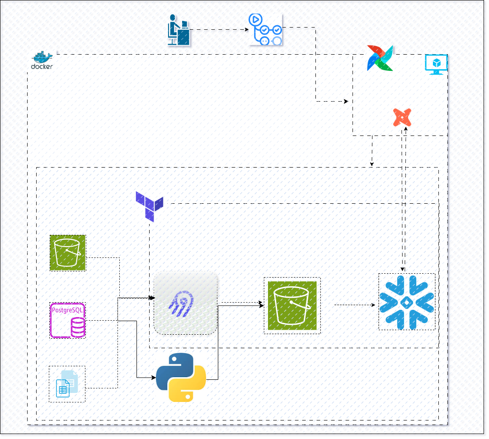

# SupplyChain_DataPlatform

## Project Overview
The goal of this project is to build a modern, production-grade data pipeline that ingests data from three different sources, stores it in a data lake, loads it into a data warehouse, transforms it into business-ready tables, and orchestrates the entire process automatically — while being fully containerised, reproducible, and version controlled.
Our Focus here is the data, the tools are the reliable propellers to achieving our desired results.

**Technically;** 
This project is a fully automated data pipeline with Apache Airflow. It pulls data from three different sources, lands everything in Amazon S3 as Parquet files, loads each source into Snowflake using `COPY INTO`, and only proceeds to downstream transformation after every single source has successfully landed and loaded.

If anything fails at any point, a Slack alert fires immediately identifying exactly which source broke, which task failed, which run it was, and what the error was. Nothing moves forward until everything is clean.
The pipeline is designed around one core principle — **every concern lives in exactly one place**. 

## The Problem This Solves
Raw data lives in multiple disconnected systems. Business decisions cannot be made from raw, untransformed data scattered across different sources. This pipeline solves that by:
- Centralising data from all sources into one place
- Automating the entire data flow daily without human intervention
- Ensuring data quality through automated testing
- Making the pipeline reproducible by anyone who clones the repository
- Making the infrastructure deployable with a single command

## Architecture Overview
Three Data Sources
        ↓
Airbyte Cloud (Ingestion) and Python 
        ↓
Amazon S3 (Data Lake)
        ↓
Snowflake RAW Schema (Loading)
        ↓
dbt Core (Transformation)
        ↓
Snowflake TRANSFORMED Schema (Warehouse)
        ↓
Airflow on VPS (Orchestration)
        ↓
Terraform (Infrastructure as Code)
        ↓
Docker (Containerisation)
        ↓
GitHub (Version Control and CI/CD)

### Here is a way to look at it diagrammatically;

## The Data Sources
We ingest from three fundamentally different source types, which demonstrates the pipeline's flexibility:
- Source 1: Amazon S3 Data already lives in S3 in its raw form. Airbyte reads directly from this bucket and moves it into our data lake bucket in an organised structure.
Having studied each, ingestion strategy was that the ingestion code reads it in chunks to keep memory usage flat on the Airflow worker regardless of file size. Each chunk is processed and written to S3 as Parquet before the next chunk is loaded into memory.

- Source 2: PostgreSQL Database A relational database containing structured transactional data. The database credentials are stored securely in AWS Parameter Store, and Airbyte retrieves them at run time. Ingestion strategy - Airbyte Cloud handles the extraction from Postgres and writes the data to S3. Airflow's job is to trigger the sync via the Airbyte API, poll the job status every 30 seconds until it finishes, verify the result using the job ID, and then load the landed data into Snowflake.

- Source 3: Google Sheets Unstructured business data maintained in a spreadsheet. A small reference file,  Python code reads it via the Google Sheets API and writes it to S3 as Parquet.

## Why S3 as the landing zone(Data Lake)

S3 is used as the intermediate landing zone for all three sources before Snowflake loads them. This is a deliberate architectural choice for several reasons.
All data lands in one place first, which makes it easy to inspect, debug, and reprocess if needed. If a Snowflake load fails, the file is still in S3 — we can rerun just the Snowflake task without re-ingesting. S3 handles concurrent writes without issue as long as each source writes to its own prefix, which is enforced by the path structure.

## Why Snowflake as the DataWarehouse
Snowflake separates compute from storage. We only pay for compute when queries are running. Auto suspend set to 60 seconds means the warehouse shuts down when idle. It runs seamlessly with dbt

## The Seven Tables and Loading Strategy
Seven tables total across the three sources. They fall into two categories with different loading strategies:

- Four Static Tables — **Full Refresh Weekly**: These are reference or lookup tables that rarely change. Every time they are loaded we truncate the existing table in Snowflake and reload completely. Because the data is small this is fast and ensures we always have the complete current dataset. These run weekly or on demand.
  
- Three Dynamic Tables — **Incremental Daily**: These tables receive new records every day. We never reload historical data. Every day we load only new records from S3 into a Snowflake staging table and run a MERGE into the final table. MERGE checks each record against a unique key — updates if it exists, inserts if it does not. This keeps performance consistent as data grows.

